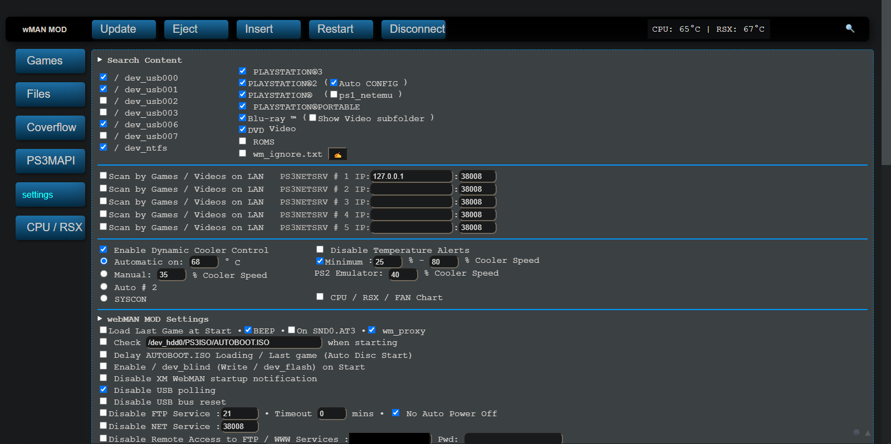

# Setup

Let's get through the Setup page. If you're on webMAN's internal web server, you'll probably see a screen similar to this:

In this page, we'll go through all of the setup page's options. I noticed some people couldn't work everything out (such as fan control) and gave up on webMAN, and this is meant to change that fear of many options and possibly messing up.

## Search Content

The **Search Content** section allows you to customize what items that webMAN should look for when you first boot your console (or enable HEN) or choose to refresh the games list. 

The section marked with the green arrow will indicate the directories webMAN is to search in, with `/dev_usb00X` being USBs in FAT32 and `/dev_ntfs` being USBs in NTFS. This will search any folders of interest, which can be found on the [Dealing with Games](../../../../welcome-to-wiki/dealing-with-games.md) wiki page.

The section marked with the blue arrow will indicate the types of formats to look for. These are the available options and their corresponding definitions:

| Option | Definition|
| :---: | :---: |
| **PlayStation 3** | PS3 games |
| **PlayStation 2** | PS2 games |
| **PlayStation** | PSone games |
| **PlayStation Portable** | PSP games |
| **Blu-ray** | Bluray movies and TV |
| **DVD Video** | DVD |
| **ROMS** | RetroArch ROMS |