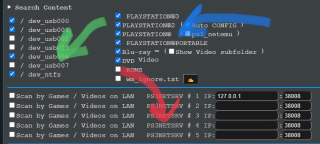

# Setup

Let's get through the Setup page. If you're on webMAN's internal web server, you'll probably see a screen similar to this:

In this page, we'll go through all of the setup page's options. I noticed some people couldn't work everything out \(such as fan control\) and gave up on webMAN, and this is meant to change that fear of many options and possibly messing up.

## Search Content

The **Search Content** section allows you to customize what items that webMAN should look for when you first boot your console \(or enable HEN\) or choose to refresh the games list.

The subsection marked with the green arrow will indicate the directories webMAN is to search in, with `/dev_usb00X` being USBs in FAT32 and `/dev_ntfs` being USBs in NTFS. This will search any folders of interest, which can be found on the [Dealing with Games](../../../../welcome-to-wiki/dealing-with-games.md) wiki page.

The subsection marked with the blue arrow will indicate the types of formats to look for webMAN can search for PlayStation 3/2/X/Portable games, Blu-ray or DVD backups, and RetroArch ROMs \(requires [pkglauncher](addons.md) addon\). 

The section marked with the red arrow will indicate the network servers that webMAN should look for. [PS3netsrv](setup.md) is a program that allows you to stream games over the network to your console, and webMAN MOD is tightly integrated with this functionality.

## Cooler Control

webMAN MOD includes utilities to alter your cooler system settings \(aka fan control\). With these settings, you can prevent common issues and help extend the life of your system, as well as alliviate the potential for the system to shut down spontaneously or... repair a Yellow Light of Death.

The "Enable Dynamic Cooler Control" option tells webMAN whether or not it should control the cooler's power, and the options around it all require that it be turned on.

webMAN includes different modes for cooler operation.

* **Automatic at x°** sets the manual selected speed \(in this case, 35%\) and uses this speed until it reaches x° C \(x is 68 in this case\). Once the system reaches that set temperature, webMAN will take control of your cooler system and help cool down.
* **Manual** sets the manual selected speed \(still 35%\) and uses this speed regardless of temperature. This can be helpful if you are looking to quiet down your system, however you need to make sure you don't set this too low because webMAN and the system's controller won't help you **even at high temps!** 
* **Automatic \#2** uses a configuration from webMAN to work with your cooling system. This one is recommended because it's quiet and not stepped, unlike the system's default settings.
* **SYSCON** hands control back to the system's controller, as if webMAN didn't have cooler control settings. This one still works, just bear in mind that your cooler won't act any different than the system's usual of stepped speeds at different temps.
  * If you're using a model that is more common to succumb to a Yellow Light of Death \(all phats and the 2xxx-25xx slims\), don't use this option. Use **Automatic \#2** or set your own fan speed on **Manual** and keep the temps lower to lengthen the amount of time your console has.

Other settings that effect the cooler settings are available to the right of the options mentioned above.

* **Disable Temperature Alerts** does what it says. When the system gets way to hot, it will beep and say something like "CRITICAL OVERHEATING!" in a notification at the top right with this disabled. With this enabled, webMAN will suppress those notifications.
* The **cooler speed range** indicates the allowed speeds that webMAN is allows to go to when set to **Automatic \#2** or **Automatic at x°**. In this case, there is a minimum of 20% and maximum of 80%. This means that the cooler will never turn off and will never reach max speed.
  * If you're using a model that is more common to succumb to a Yellow Light of Death \(all phats and 2xxx-25xx slims\), you should keep the minimum at least 20%.
* **PS2 Emulator** marks what the cooler speed should be for PlayStation 2 emulation. This should always be above your **Manual** speed.
  * If you are using **Automatic \#2**, you can still find out what speed to put your emulator at with a test. Hold SELECT+START until your console beeps and go into a game. Wait for the fans to slowly rise and record their speed. Set the emulator speed to +5%-10% of the speed you just found.
  * If you don't play PlayStation 2 games, then you don't need to worry about this setting.

The **CPU / RSX / FAN Chart** option changes the view of the page described in [Monitoring](monitoring.md) from simple numbers to a chart that collects information since the system was turned on.

## webMAN Settings

webMAN MOD's Settings section tells it how to operate and interact with your system, other homebrew, and its services. This section will be split in half, just like the picture is up above.

### Section I

The first three options deal with **auto launching,** a feature that allows you to launch games on a boot up of the console.

* **Load Last game at Start** does exactly what it says, and it loads the last played game at startup.
  * The **BEEP** flag signifies whether or not your console should beep when the game is succesfully mounted.
  * The **On SND0.AT3** signifies whether or not your console should play the game's preview music \(the music when you hover over it\) on the XMB.
  * **wm\_proxy** is a VSH plugin that lets webMAN take control of what's on the XMB. If you're having trouble getting your most recent game to automatically load, try enabling this.
* **Check /dev\_hdd0/PS3ISO/AUTOBOOT.ISO when starting** specifies a game to always mount at start, whether or not you've recently played it.
* **Delay loading** controls whether or not to give webMAN time to load and start the game. This can be helpful if your console is low on space \(because the console will be slower if there is more content that needs to be processed\) and you're having trouble getting games to automatically load.

The **/dev\_blind** feature allows you to mount the /dev\_flash directory as world-writable and let you edit its contents. This is recommended to be turned off unless you require access to changing contents of this directory.

**Disable XM webMAN startup notification** prevents webMAN from sending a notification about webMAN successfully being loaded. This can be helpful if you don't want 600 notifications on startup, but can be annoying when webMAN isn't working properly and you need to debug.

The two USB options help deal with USB drives.

* **Disable USB polling** makes it so that your console won't spend time pinging your USB devices to keep them alive. 
  * If you have Auto Power-Off enabled in the Power Save Settings of the console, this will make your console shut off even if USB devices are attached. 
* **Disable USB reset** fixes a bug that can happen where your USB appears as `/dev_usb` and not `/dev_usb00X`in 4.20+ firmwares, causing slowdowns on reads and writes and potentially hanging your console as the system tries to catch up.

If you're going to remotely interact with your console, such as by connecting through an [FTP client](../../../pc-tools/ftp-client.md) to copy files and games or using the [/cpursx.ps3](monitoring.md) page to monitor your system's thermals, activities, and information, the next three options control the security of these interactions. By default, the following occur:

* FTP servers have a port of 21. The **Disable FTP service** section allows you to tweak the port and password for webMAN's built-in FTP server, or shut it down entirely.
  * **No Auto Power Off** controls whether or not webMAN should respect the Auto Power-Off option in the Power Save Settings of the console. If you're transferring large files and want to leave it while you're away from the system and have Auto Power-Off enabled, make sure to enable this option.
  * **Disable FTP service** completely turns off the FTP server for webMAN. No other homebrew are affected--so you can still use multiMAN or a dedicated homebrew's FTP server like normal. This is highly recommended to use when going online in a multiplayer match or any event that another user can potentially hack your console and [steal your console ID](../../../debugging-apis/cid-protection.md)
  * The **Port** number is usually 21, if you haven't changed it yet. This can be changed to any port from 0 to 65353, but cannot be the same as the one specified in the **Disable NET service** section, or port 443.
* The PS3netsrv port is set to 38008. The **Disable NET service** allows you to change what port that your PC can use to load games onto for your console, as well as shutting it down entirely.
* FTP connections and the internal web server are open, no password or username for everyone. The **Disable Remote Access to FTP/WWW Services** section allows to set credentials that remote users require to connect to either service, or disable anyone without access to your console from connecting.
  * **Choosing to set a username and password will take effect immediately,** and devices already connected will have to connect again.
  * These options don't just affect using the servers from outside of your network: **devices on your network will have to bow down to these options too**.
  * Disabling remote access only does just that: you can still access the /setup,ps3 page **if you're on the console itself**.

**Remove SingStar Icon**... well, removes the SingStar icon from the console. This only affects European and Asian consoles, North American users don't have a SingStar icon in their Games column.

**Auto Install PKG** lets webMAN look in `/dev_hdd0/packages` for anything new and automatically install it. This is helpful if you're doing a batch update of all your homebrew and don't want to click each package over and over.

**Unlock saves** make it so that you can copy and duplicate game saves even if they are copyright locked, and allows them to work with another user's account. This is required if you're thinking about resetting your console or need to copy saves but don't want your games to refuse them.

### Section II

Here's that image again. We're focusing on the second part now.

The first four options deal with disabling parts of how the "webMAN Games" folder on the XMB acts.

* **Disable Content Scanning at Start** prevents webMAN from looking for the items specified in [Search Content](setup.md#search-content) when you boot your console. This can speed up your console a lot depending on how many games you have, and does not affect manual refreshes of the XMB or web games list.
* **Disable Content Groups in "My Games"** controls how webMAN organizes the webMAN Games folder on the XMB. Without this enabled, you will have subfolders marked by the names of the content that they correspond to \(like if you set the Games column sorting to "Form\). With it enabled, all of your games will be listed without subfolders \(like if you set the Games column sorting to "All"\).
* **Disable webMAN Settings in "My Games"** prevents the "webMAN Settings" option from appearing in the webMAN Games folder. 
  * This is helpful if you're trying to lock down webMAN from someone that's exploring your console but has a history of changing settings that should not be changed.
* **Disable multiMAN covers** changes where webMAN should gather icons for games. 
  * **MM COVERS** tells webMAN to look for multiMAN's icons. If multiMAN is not installed, this option has no meaning.
  * **ONLINE COVERS** tells webMAN to use the Title ID and game name to search the internet for an icon.
  * **PIC0.PNG** allows you to choose the game's included icon as the cover.
  * **NONE** turns all of webMAN's listed games into disc icons, corresponding to the type of disc.