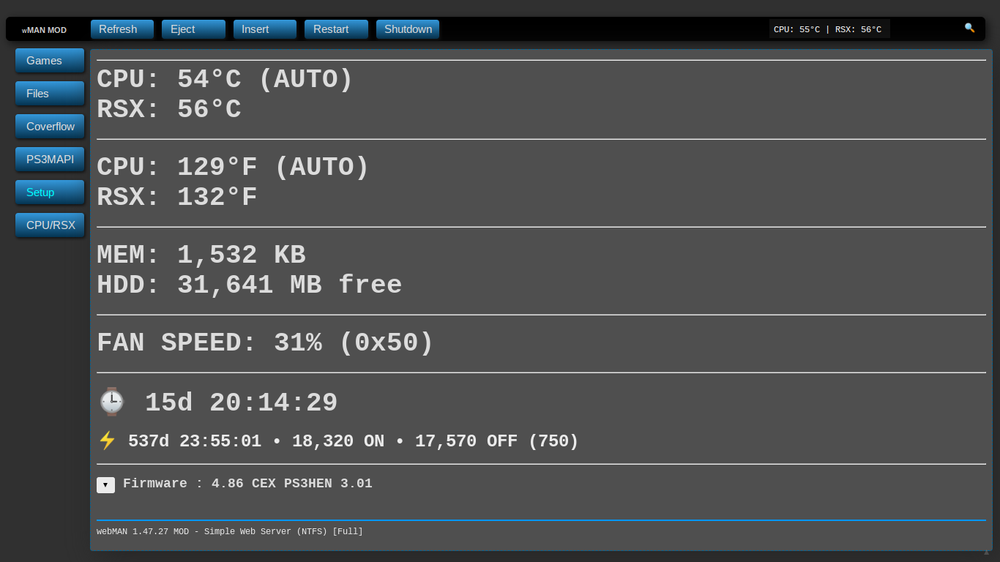

# Monitoring

webMAN contains tools for system monitoring, which prove time and time again to be very helpful when you want to see what's going on and whether or not you should take action immediately.

This page will go through all of the ins and outs of this section of the web interface.

The red section in the picture above shows the current **console temperatures**. This section gathers its information from the sensors on the CPU and GPU themselves, but only updates every 16 seconds which can make for a slightly inaccurate result (although in the long run, this  doesn't really matter as no console will rise to dangerous levels or cool to an ice cube in 16 seconds). Console temperatures are also shown in Celsius (C) and Fahrenheit (F). If you are inquiring about console temperatures in your posts, use the Celsius measurements rather than Fahrenheit.

The yellow section in the picture shows information about **system memory and storage**.
 * PlayStation consoles ship with 256MB of system memory (we discuss system specs more on the [Developer Information](../../../../welcome-to-wiki/developer-information), and this will usually sit around 5000-1000KB free. Don't worry though, you can get away with this, and you can change webMAN's [memory usage](../customizing/setup.md) if you feel that the number you have is too small.
 * Your system storage will count what's free, but you have to remember about reserved space too. If what's free is less than you expected, it's probably just the system's reserved space and formatting what-nots affecting it. 

The purple section in the picture shows your **cooler speed**. You can adjust the settings in the [Setup](../customizing/setup.md) page or, if you have the speed set to Manual or SYSCON, change it using the slider underneath the percentage.

The blue section in the picture shows your **power supply information**. Just like any other power supply, it gives the system information on how long it's been on and used with the console on or off.
 * The clock icon shows the system uptime (how long it's been on)--either with games or sitting at the XMB.
 * The lightning icon shows how much time has passed since you first started using this power supply--which is most likely how long it's been since you unboxed your console, minus any time you've had it unplugged (not in standby mode, unplugged!)

And lastly, the green section in the picture is **"the misc section"**. This information shows your firmware and webMAN's usual footer.

 * If the footer doesn't say **Simple Web Server \[Full\]**, then it's most likely not running the full version of webMAN MOD. If you chose to use the lite version or have the vanilla webMAN, some features that we discuss in this section won't be available.
 * If you click the arrow next to **Firmware**, you'll see information about your PSID, IDPS, and your MAC address. If you're on this page with a computer, you probably already know the LAN address that's listed here.

**NOTE**: My homebrew stuff is out of date because I haven't played on my PlayStation 3 in a while and I use it as an FTP server. However, all of the information will be present on the current version of webMAN MOD.

