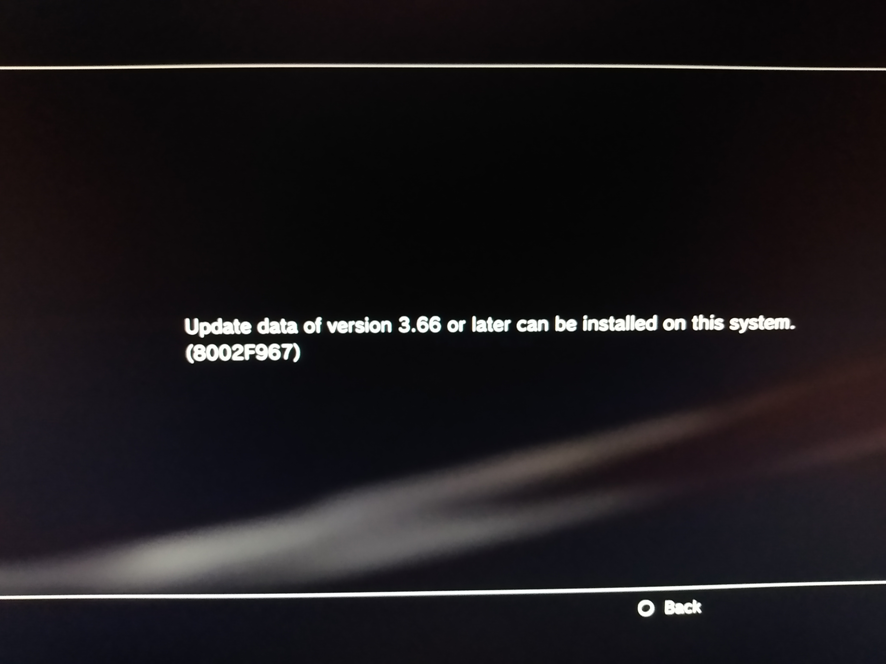

# Custom, Hybrid, or Modified?

## Time for a complicated talk.

### Custom Firmware

**Custom Firmware \(CFW\)** is the complete package. By taking the firmware from 3.55 and applying it to the latest OS, **certain** systems can use custom firmware and have complete access to the hypervisor, kernel, and internals of their PlayStation, and achieve everything mentioned on the [About Jailbreaking](../faq/about-jailbreaking.md) page. 

However, a full CFW requires a PlayStation 3 model that supports installing firmware 3.55. Model numbers **can't** be used to verify this ability, but a script called [minverchk](https://www.psx-place.com/resources/minverchk-minimum-version-checker.610/download?version=967) can detemine if it's possible.

### Hybrid Firmware

**Hybrid Firmware \(HFW\)** is for those people with a firmware base of 3.56 or higher. 

