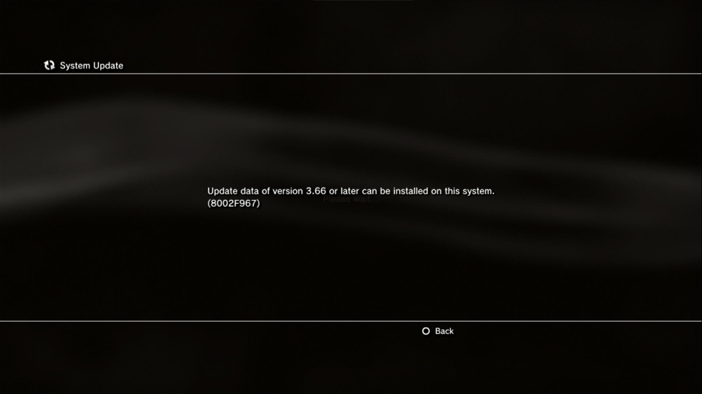

# Custom, Hybrid, or Modified?

## Time for a complicated talk.

### Custom Firmware

**Custom Firmware \(CFW\)** is the complete package. By taking the firmware stuff from 3.55 and applying it to the latest OS, **certain** systems can use custom firmware and have complete access to the hypervisor, kernel, and internals of their PlayStation, and achieve everything mentioned on the [About Jailbreaking](../welcome-to-wiki/about-jailbreaking.md) page.

However, a full CFW requires a PlayStation 3 model that supports installing firmware 3.55. Model numbers **can't** be used to verify this ability, but a script called [minverchk](minverchk.md) can detemine if it's possible.

### Hybrid Firmware

**Hybrid Firmware \(HFW\)** is for those people with a firmware base of 3.56 or higher. Made by the ps3xploit team, this type of firmware allows non-CFW compatible console models to run homebrew. This is possible because the team takes an exploitable version of WebKit from 4.82 and pushes it into the latest firmware, and allows you to install PS3HEN. In the case of HFW compatible consoles, every model is supported, but any 3xxx series or newer \(Slims without the blue light above the eject button and all Super Slims\) can only use HEN. Certain models of the 25xx series can only use HEN, but this can be verified using minverchk.

### Modified Firmware

**Modified Firmware \(MFW\)** is the CFW you get to make yourself. The MFW Builder program allows you to tweak the system to your liking, and start with either OFW or CFW as a base for your modifications. Swap out coldboot files, enabled syscalls, re-enable features, MFW falls under the same device restrictions as CFW, so you'll need a system with a base version of 3.55 or lower to be able to use it.

