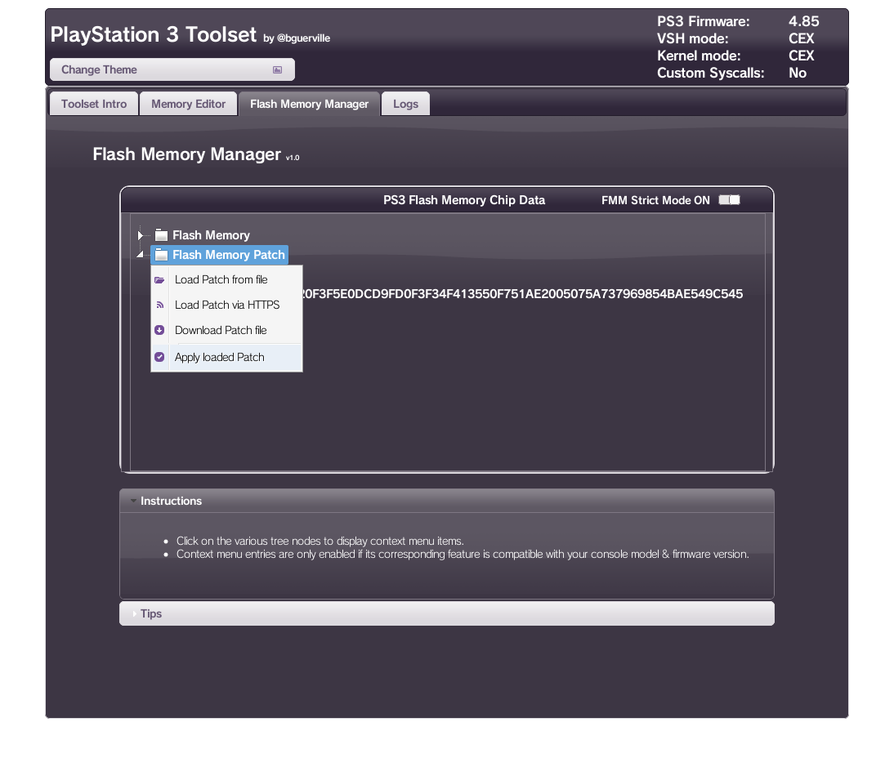
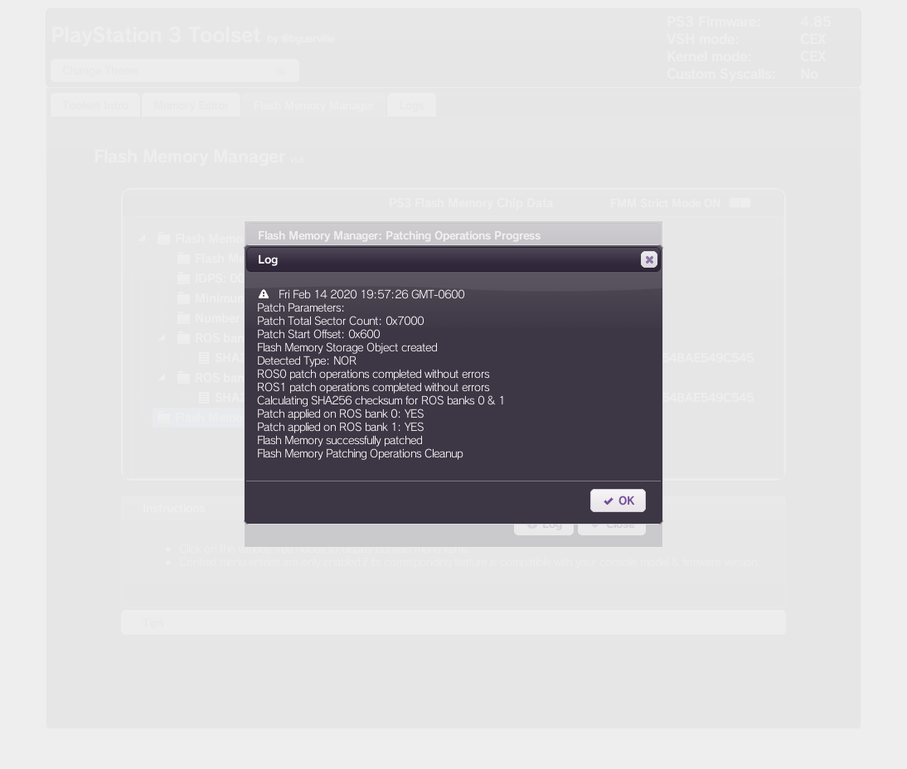

# bguerville toolset

The bguerville toolset provides useful functionality to get information about your console and, more importantly, help you patch your console without factory service mode or a firmware flasher. This option is safer than the ps3xploit default option because of how bguerville’s toolset can verify whether or not the system is downgradable and prevents you from doing anything without proper initialization of this process.

The bguerville toolset is fairly easy to use and provides tools to patch your firmware and peek/poke your memory at will. It also shows information about your console and can make informed decisions based on that--such as disabling certain features if you have a minimum downgrade praxis of 3.56 or higher, or not letting you use any of the features if you aren't on a PlayStation in the first place. The bguerville toolset is based off of "ps3xploit version 4.0", which was a new exploit found and mastered by bguerville and adapted for this purpose with the toolset.

# Materials Needed

* Internet connection
* A CFW compatible PS3
* Adobe Flash enabled (the dialog box that asks "Do you want to run the plugin?", make sure you choose yes.)
* Firmware 4.80 to 4.87

# Patching your flash

1. Go to the [bguerville toolset](ps3xploit.net/bguerville) page on your console.

2. Switch to the "Flash Memory Manager" tab. Here you should see an option marked **Flash Memory Patch**. If you don't see it, it means you're probably not CFW compatible and should install [PS3HEN](../ps3hen/)

3. Clicking on this option with show a dropdown box.

* **Load Patch from file** searches any connected USB devices and looks for patch files that can be applied to your system.

* **Load Patch from HTTPS** asks you for a URL to download the patch from, let's say, a self-hosted web server.

* **Download Patch file** downloads a patch made my bguerville.

The option marked **Apply loaded patch** will be greyed out until a patch is loaded into the console's memory using on of the options above.

4. Choose your method of loading the patch into the system's memory. Each nethod comes with obvious drawbacks, but it's easier to supply your own. When you decide which option to go for, the patch will start to load into the system's memory.

